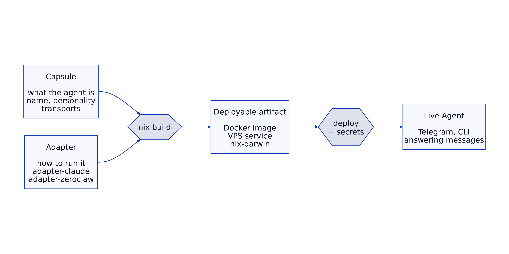

A **capsule** (what the agent is) and an **adapter** (how to run it) combine through `nix build` into a deployable artifact. The artifact gets deployed with secrets injected, and the agent goes live.




## Capsule

A capsule is a Git repo containing a single `flake.nix`. It declares the agent's identity — name, system prompt, model, provider, transports — without knowing anything about how the agent will be run.

```nix
agent = {
  name = "Ada";
  system-prompt = "You are Ada, a helpful assistant.";
  provider = "claude-code";
  model = "sonnet";
  transports.telegram = {};
};
```

The capsule imports an adapter as a flake input. It calls `lib.mkAgent { agent = { ... }; }` and the adapter produces a deployable artifact — a Docker image, a VPS service, or whatever the target platform needs.

## Adapter

An adapter is a Nix flake that exports `lib.mkAgent`. It takes the universal agent config and translates it into whatever the target runtime needs — config files, environment variables, entrypoint scripts.

Each adapter lives in its own repo:

- **adapter-claude** — wraps Claude Code CLI with a bash Telegram long-poll loop
- **adapter-zeroclaw** — generates TOML config for the ZeroClaw Rust runtime

The adapter interface is simple: `lib.mkAgent { agent }` returns a Nix attribute set with deployable outputs.

## Runtime

The runtime is the LLM backend that actually runs the agent. Reflection doesn't implement runtimes — it integrates them. Current runtimes:

- **Claude Code CLI** — Anthropic's CLI tool, used via `adapter-claude`
- **ZeroClaw** — open-source Rust binary with built-in tools, used via `adapter-zeroclaw`

Runtimes are a replaceable detail. When a better runtime appears, you write a new adapter and switch with one line in `flake.nix`.

## Data flow

The capsule and adapter combine at build time. Secrets are injected at deploy time:

1. `nix build` — capsule config + adapter logic → deployable artifact (e.g. Docker image)
2. Deploy — artifact runs with secrets injected (API keys, bot tokens via env vars or config generation)
3. Runtime starts, connects to transports, answers messages

Secrets are never baked into the artifact. They're injected at deploy time via environment variables or config file generation.

## Switching adapters

Changing which runtime powers your agent is a one-line change in `flake.nix`:

```nix
# Before: Claude Code backend
inputs.adapter.url = "github:reflection-network/adapter-claude";

# After: ZeroClaw backend
inputs.adapter.url = "github:reflection-network/adapter-zeroclaw";
```

Same agent identity, different plumbing.

## Dev workflow

The [dev launcher](/launcher/) automates the build-deploy cycle:

1. Launcher polls the capsule's Git repo for changes
2. On new commits, creates a worktree for the new revision
3. Runs `nix build` to produce a Docker image
4. Stops the old container, starts the new one
5. Agent is live with the updated config

## Schema design

The agent config schema lives in `agent.nix`. Design principles:

- **Required fields are minimal**: `name` and `system-prompt` only
- **Optional fields grow from real needs**: `provider`, `model`, and `transports` were added when the second adapter needed them
- **Backward compatible**: new optional fields don't break existing capsules
- **No speculative fields**: nothing gets added until running code needs it
